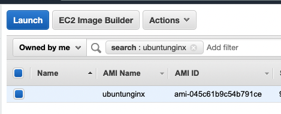

# Create an AMI on AWS with Packer

This repository describes the steps to create an AWS image using Packer. In this example the AMI will be an Ubuntu image with nginx installed and enabled. 

# Prerequisites

## Install Packer  
See the following documentation [How to install Packer](https://learn.hashicorp.com/tutorials/packer/get-started-install-cli)

## AWS
You need access to AWS and have the following credentials
```
AWS_ACCESS_KEY_ID
AWS_SECRET_ACCESS_KEY
AWS_SESSION_TOKEN
```

# How to

1. Clone the repository to your local machine
```
git clone https://github.com/munnep/PackerAWSUbuntuNginx.git
```
2. Change your directory
```
cd PackerAWSUbuntuNginx
```
3. Open the packer file `ubuntunginx.prk.hcl` and change the region variable to match your preference
```
variable "region" {
  type    = string
  default = "us-west-2"
}
```
1. Set your AWS environment settings in the terminal with your own credentials  
linux/macOS
```
export AWS_ACCESS_KEY_ID=
export AWS_SECRET_ACCESS_KEY=
export AWS_SESSION_TOKEN=
```
Windows
```
set AWS_ACCESS_KEY_ID=
set AWS_SECRET_ACCESS_KEY=
set AWS_SESSION_TOKEN=
```
5. Execute the Packer initialization
```
packer init .
```
5. Execute the Packer initialization
```
packer build .
```
6. You should see some of the following output
```
...
==> ubuntunginx.amazon-ebs.ubuntunginx: Synchronizing state of nginx.service with SysV init with /lib/systemd/systemd-sysv-install...
==> ubuntunginx.amazon-ebs.ubuntunginx: Executing /lib/systemd/systemd-sysv-install enable nginx
...
```
7. You should see the AMI now under the AWS AMI Management page  
  

